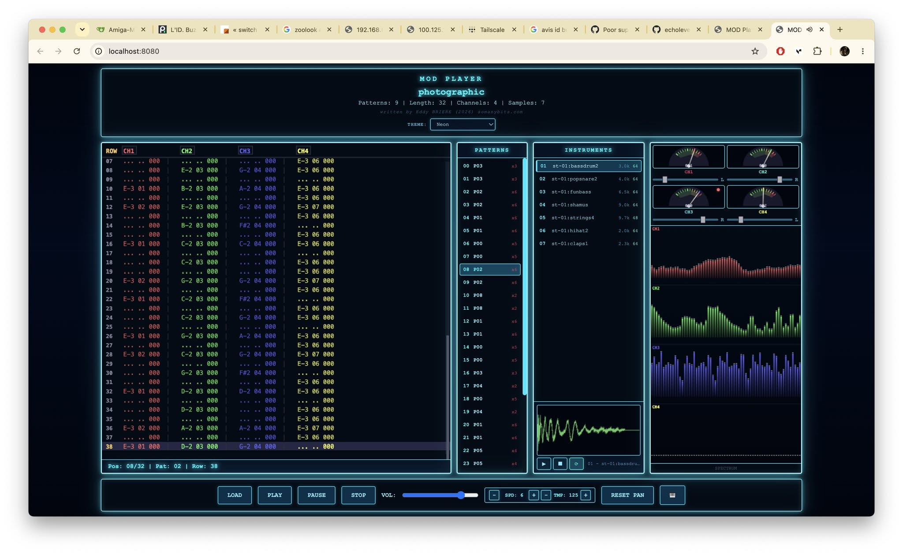

# MOD Player



Un lecteur de modules **Amiga .MOD** en JavaScript pur, avec visualisation temps réel du pattern, instruments, samples et partitions musicales. Il émule le son caractéristique de la puce audio **Paula** de l'Amiga (synthèse 4 canaux 8-bit).

---

## ✨ Fonctionnalités

### ▶️ Lecture de modules
- Charge des fichiers **.MOD** (formats ProTracker et dérivés : M.K., M!K!, 4CHN, 6CHN, 8CHN…)
- Lecture fluide via l'**API Web Audio** avec synthèse 4 voies 8-bit (style Paula)
- Contrôles de lecture : **Play / Stop** , volume, tempo (rapide/lent)
- Navigation : liste des **patterns** (clic pour sauter), suivi de la position (POS / PAT / ROW)

### 🎹 Synth keyboard « KEYS »
- Clavier de piano visuel affichant en direct les notes jouées par chaque canal
- **1 à 8 octaves** visibles, avec navigation horizontale par glisser-déposer (drag)
- Points lumineux colorés par canal avec dégradé/glow
- **CH1** = rouge | **CH2** = vert | **CH3** = bleu | **CH4** = jaune

### 🎼 Mode partition « SCORE »
- Affiche le pattern courant sous forme de **portées musicales**, une par canal
- **Durées de notes** déduites du pattern : croche (1 ligne), noire (2), blanche (4), ronde (8+)
- **Lignes supplémentaires** (ledger lines) pour les octaves extrêmes, avec clamage anti-chevauchement entre portées
- **Curseur de lecture** vertical animé qui suit la lecture en temps réel
- **Lignes verticales de changement d'instrument** : survolez-les pour afficher le **numéro et le nom** de l'instrument (tooltip)

### 📊 Visualisation temps réel
- **Spectre** par canal (4 spectres empilés, un par voix) — cliquez pour changer de mode
- Modes : **SPECTRUM**, **SCOPE** (oscilloscope stéréo), **BOTH**
- **VU-mètres** de niveau avec crêtes (peaks) des 4 canaux

### 🎚️ Instruments & Samples
- Liste des **instruments** du module (numéro, nom, volume, longueur)
- **Échantillonneur** : visualisation de l'onde d'un sample en oscilloscope
- Boutons **Play / Stop / Loop** pour écouter un sample
- Affichage de la boucle (loop) du sample en surimpression

### 🔍 Zoom & clavier de notes (Sample Viewer popup)
En cliquant sur le canvas de l'échantillonneur, un **popup agrandi** s'ouvre avec :
- **Sélecteur d'instrument** : une combo box dans l'en-tête permet de **changer directement d'instrument** depuis le popup (affiche par défaut l'instrument courant)
- **Zoom** : molette de la souris (centrée sur le curseur) ou boutons **+ / −**, avec affichage du pourcentage
- **Réinitialisation** du zoom avec le bouton **⟲**
- **Défilement** horizontal par clic-glisser (drag) lorsque le sample est zoomé
- **Clavier de notes** : jouer le sample à différentes hauteurs sur **12 notes** (C- à B-) et **0 à 5 octaves** (sélecteur)
- La lecture respecte le pitch ProTracker : le sample joue à sa hauteur native à C-3 (période 214), chaque demi-ton/octave ajuste la fréquence

### 🎚️ Balances (Pan) des canaux
- **Curseurs de balance stéréo** par canal (L — C — R), réglables individuellement
- Ce réglage **n'est pas compatible avec l'Amiga** (dont la sortie est monophonique) : il s'agit d'un **confort d'écoute amélioré** propre à ce lecteur
- Il permet de **mieux répartir les canaux** dans le champ stéréo et d'**améliorer l'écoute** en séparant les voix
- Bouton **RESET PAN** pour **réinitialiser toutes les balances** et revenir au **rendu d'écoute original de l'Amiga**

### 🎨 Thèmes
13 thèmes de couleur : **Amiga** (défaut), Dark, Light, Sunset, Blue Wave, Green Forest, Orange, Purple, Gray, Blue Light, **Neon** (style Tron avec halo cyan lumineux), **Retro Game** (vert phosphore), **Old School** (sépia vintage).

---

## 🚀 Démarrage rapide

```bash
# Ouvrir directement dans le navigateur (aucune installation requise)
open index.html
```

> L'application est 100% statique (HTML/CSS/JS), aucune dépendance ni serveur nécessaire.

## 📁 Structure du projet

```
.
├── index.html               # Page principale
├── css/
│   └── style.css            # Styles, thèmes, layout
├── js/
│   ├── main.js              # Orchestration, chargement du fichier, boucle de rendu
│   ├── modplayer.js         # Cœur du lecteur : parsing MOD, synthèse audio (Paula)
│   └── visualizer.js        # Visualisations : synth keyboard, partition, spectre, VU-mètres
└── docs/
    └── structure-fichier-mod-amiga.md   # Documentation détaillée du format .MOD
```

---

## 🎮 Utilisation

1. **Charger un module** : utilisez le bouton de chargement dans l'interface (ou glissez un fichier `.mod`)
2. **Lancer la lecture** : bouton **PLAY**
3. **Explorer les patterns** : cliquez sur un pattern dans la liste de droite pour y sauter
4. **Clavier synthé** : bouton **KEYBOARD** pour ouvrir le popup
   - Réglage **OCTAVES** pour changer la plage visible
   - **Drag & drop** sur le clavier pour naviguer dans les octaves
   - Bouton **MODE** pour basculer entre `KEYS` (clavier) et `SCORE` (partition)
5. **Visualisation** : cliquez sur la zone de visualisation pour changer de mode (spectre/scope)
6. **Samples** : sélectionnez un instrument, puis **play / stop / loop** dans l'échantillonneur
   - **Cliquez sur le canvas** de l'échantillonneur pour ouvrir le **popup agrandi**
   - **Combo box d'instrument** dans l'en-tête du popup pour **changer d'instrument** directement (synchronisée avec la liste INSTRUMENTS)
   - **Zoom** à la molette ou boutons **+ / −**, **reset** avec **⟲**, **défilement** par clic-glisser
   - **Clavier de notes** : choisissez une octave et cliquez une note pour jouer le sample à cette hauteur
7. **Balances** : ajustez les curseurs **L — C — R** de chaque canal pour répartir les voix dans le champ stéréo ; **RESET PAN** pour revenir au rendu mono original de l'Amiga

---

## 🧠 Comment ça marche

### Le format .MOD
Le fichier .MOD (format ProTracker) est analysé pour extraire :
- Les **échantillons** (samples 8-bit) et leurs boucles
- Les **patterns** (matrices de données note/instrument/effet, 64 lignes × 4 canaux)
- La **song order** (liste ordonnée des patterns)

Voir [`docs/structure-fichier-mod-amiga.md`](docs/structure-fichier-mod-amiga.md) pour la documentation détaillée du format.

### La synthèse sonore
Le lecteur **réimplémente la puce audio Paula** de l'Amiga : 4 canaux de lecture 8-bit, chacun avec sa période (fréquence), son volume et sa boucle. La génération est faite en JavaScript par rendu audio temps réel.

### Le mode partition
Chaque canal est converti en portée musicale : les périodes du pattern sont mappées en notes MIDI, puis regroupées en figures de durées (croche, noire, blanche, ronde). Les changements d'instrument sont détectés par changement de sample et marqués par une ligne verticale cliquable (tooltip au survol).

---

## 🛠️ Technologies
- **JavaScript** (ES6, classes)
- **Web Audio API** (AudioBufferSourceNode, synthèse 8-bit clonée de Paula)
- **Canvas 2D** pour toutes les visualisations
- Aucune dépendance externe

---

## 📄 Licence
Projet personnel — écrit par **Eddy Briere** (2026) · [somanybits.com](https://somanybits.com)

Libre d'utilisation pour l'apprentissage et les projets personnels.

---

## 🙏 Crédits
- Le format .MOD et la puce Paula : Commodore Amiga, Karsten Obarski (Soundtracker), Future Crew (ProTracker)
- La scène demoscene/module Amiga pour avoir inspiré ce genre de visualisation rétro